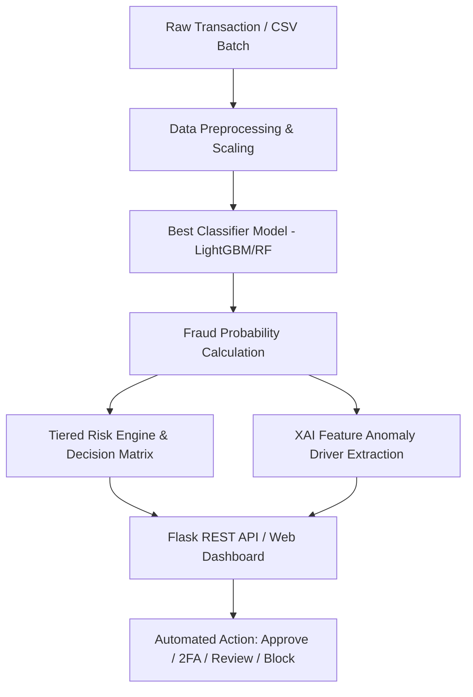

# 🛡️ Credit Card Fraud Detection — Enterprise AI System

A comprehensive, production-grade machine learning system for detecting fraudulent credit card transactions in real time. Features **4 competing ML algorithms**, **automated SMOTE resampling**, an **Explainable AI (XAI) feature anomaly engine**, a **tiered risk scoring matrix**, **batch transaction scanning**, a **glassmorphism dashboard**, and **Dockerized deployment**.


---

## 📋 Overview

Credit card fraud represents billions in global annual losses. This project addresses the extreme class imbalance problem (284,807 transactions with only 0.17% fraud) utilizing the Kaggle/ULB European cardholder benchmark dataset.

### Key Highlights
- 🔬 **Robust Feature Pipeline**: Log-transformed amounts, cyclical hour extraction, and outlier-resistant `RobustScaler`.
- ⚖️ **SMOTE Balancing**: Synthetic minority oversampling for high-recall fraud detection.
- 🤖 **4 Competing ML Classifiers**: Logistic Regression, Random Forest, XGBoost, and LightGBM.
- 🧠 **Explainable AI (XAI)**: Identifies top anomalous feature drivers and deviations behind every fraud decision.
- 🎯 **Tiered Risk Decision Engine**: Automates actions (`APPROVE`, `CHALLENGE (2FA)`, `REVIEW`, `DECLINE`).
- 📦 **Bulk Transaction Evaluator**: Vectorized batch evaluation via JSON or CSV file uploads.
- 🌐 **Modern Web Dashboard**: Real-time glassmorphism interface with instant probability gauges.
- 🐳 **Production Ready**: Docker containerization, Gunicorn WSGI server, and GitHub Actions CI pipeline.

---

## 🏗️ System Architecture



---

## 🚦 Tiered Risk Scoring Matrix

| Risk Tier | Score Range | Automated Decision | Operational Action |
|:---|:---|:---|:---|
| 🟢 **LOW** | 0.0% – 14.9% | `APPROVE` | Frictionless instant checkout |
| 🟡 **MODERATE** | 15.0% – 49.9% | `CHALLENGE` | Trigger 3D-Secure / SMS OTP verification |
| 🟠 **HIGH** | 50.0% – 79.9% | `REVIEW` | Route to Fraud Analyst queue with temporary hold |
| 🔴 **CRITICAL** | 80.0% – 100.0% | `DECLINE` | Instant block & emergency cardholder security alert |

---

## 🚀 Quick Start

### 1. Clone & Setup
```bash
git clone https://github.com/vardefenil/Credit-Card-fraud-Detection.git
cd Credit-Card-fraud-Detection
pip install -r requirements.txt
```

### 2. Train Models (Optional if artifacts exist)
```bash
python train_model.py
```

### 3. Run Locally
```bash
python app.py
```
Open **http://localhost:5000** in your browser.

---

## 🐳 Docker Deployment

Run the complete production stack in seconds:

```bash
# Build and run with Docker Compose
docker-compose up --build -d

# Check health
curl http://localhost:5000/api/metadata
```

Or build manually:
```bash
docker build -t fraudguard-ai .
docker run -p 5000:5000 fraudguard-ai
```

---

## 🔌 REST API Reference

### 1. Single Transaction Evaluation
`POST /predict`
```json
{
  "features": [-1.3598, -0.0728, 2.5363, ..., 5.0148, 0]
}
```
**Response:**
```json
{
  "prediction": 0,
  "probability": 0.0012,
  "is_fraud": false,
  "confidence": 99.88,
  "label": "✅ LEGITIMATE",
  "risk": {
    "tier": "LOW",
    "score": 0.12,
    "decision": "APPROVE",
    "action": "Automated Approval"
  },
  "risk_drivers": [
    { "feature": "V14", "magnitude": 0.99, "impact": "MODERATE" }
  ]
}
```

### 2. Bulk / Batch Evaluation
`POST /predict/batch`
```json
{
  "transactions": [
    { "id": "TX-1001", "features": [...] },
    { "id": "TX-1002", "features": [...] }
  ]
}
```

### 3. Service Health & Uptime Probe
`GET /api/health`
```json
{
  "status": "healthy",
  "model_loaded": true,
  "scaler_loaded": true,
  "metadata_loaded": true
}
```


---

## 🧪 Testing Suite

Run all unit and integration tests with test discovery:

```bash
pytest -v
# or
python -m unittest discover tests -v
```

---

## 📁 Project Structure

```
credit-card-fraud-detection/
├── .github/
│   ├── workflows/ci.yml       # Automated CI testing pipeline
│   ├── ISSUE_TEMPLATE/        # Bug report & feature request templates
│   └── pull_request_template.md
├── models/                    # Serialized model artifacts
│   ├── best_model.pkl         # Trained classifier (LightGBM/RF)
│   ├── scaler.pkl             # RobustScaler object
│   └── metadata.json          # Model benchmarks & schema info
├── static/
│   ├── css/style.css          # Glassmorphism dark UI stylesheet
│   └── js/app.js              # Real-time charts, batch parser, animations
├── templates/
│   └── index.html             # Web dashboard interface
├── tests/
│   ├── test_api.py            # API endpoint integration tests
│   └── test_risk_engine.py    # Risk tiering unit tests
├── app.py                     # Flask application & REST endpoints
├── risk_engine.py             # Risk scoring & XAI drivers
├── train_model.py             # Full training & validation pipeline
├── Dockerfile                 # Production multi-stage Docker container
├── docker-compose.yml         # Container orchestration
├── requirements.txt           # Python package dependencies
└── README.md
```

---

## 🤝 Contributing

Contributions, issues, and feature requests are welcome!
Please check the [issues page](https://github.com/vardefenil/Credit-Card-fraud-Detection/issues) or submit a Pull Request.

---

## 📄 License

Distributed under the MIT License. Dataset courtesy of ULB Machine Learning Group / Kaggle.
